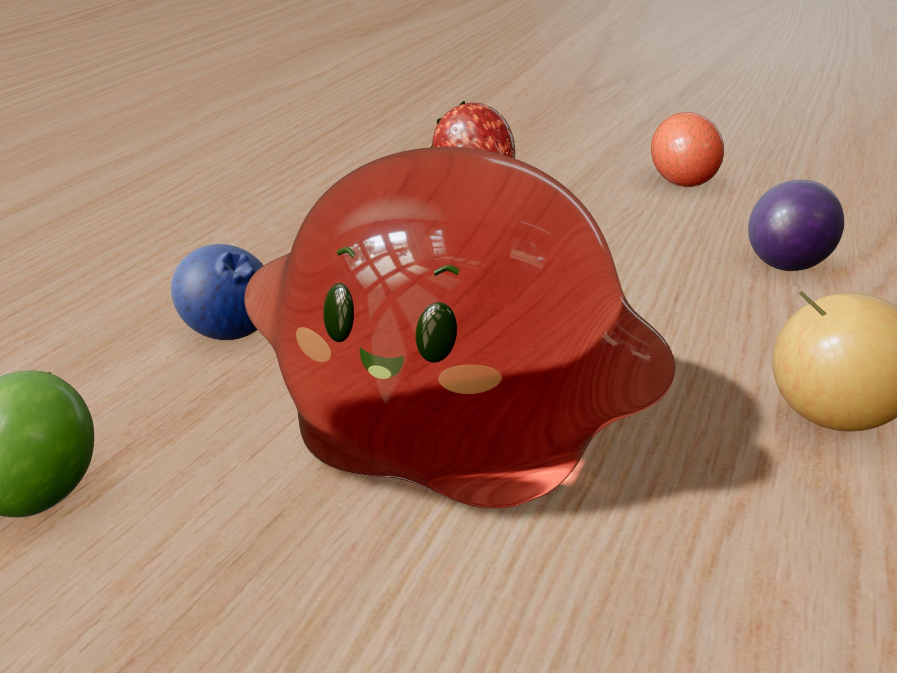

# Fruit Rush

A 60-second fruit hunt for a small, wobbly jelly. Wander across an endless wooden
table, hop, gather fruit and watch the jelly take on the flavour of every bite.



> **Inspired by and built on [Jelly Baby](https://github.com/scottstts/Jelly-Baby) by
> [Scott](https://github.com/scottstts).** His soft-body physics, optics and rendering
> are the heart of this project: without that little jelly, there would be no Fruit Rush.
> Thank you, Scott!

## Play

```sh
npm install
npm run dev
```

Needs a WebGPU-capable browser (current Chrome, Edge or Safari).

| | |
|---|---|
| **Enter** / Start | Start a 60-second round |
| **WASD** / arrows | Wander (relative to the camera) |
| **Space** | Hop |
| **Mouse drag** | Grab, stretch and throw the jelly, or orbit the table |
| **Esc** / × | Close the card and just wander around |
| **R** | Reset the jelly |

On touch devices a joystick and a hop button appear.

## How it works

- **Fruit changes the flavour.** Strawberry, grape, blueberry, mandarin, lemon and
  green grape each crossfade the jelly to their colour: surface tint and light absorption,
  so the refraction and caustics change colour too.
- **Chains and combos.** Pick fruit up quickly one after another and the pickup chime climbs
  in pitch. Every fifth fruit in a chain plays a combo fanfare and pays out bonus points
  (×5 → +3, ×10 → +6, ×15 → +9 …).
- **Highscores** are kept per device (top 5, in `localStorage`).
- **Free play.** Close the card and fruit keeps appearing, without timer or score.

## What changed compared to Jelly Baby

- **Game loop:** round timer, scoring, combos, result card and local highscores
  ([`src/game/fruit-rush.ts`](src/game/fruit-rush.ts)).
- **A rounder character:** a puff-ball silhouette with two oval feet and stubby arms,
  built from the same metaball SDF ([`refs/jelly_baby_mesh.html`](refs/jelly_baby_mesh.html),
  regenerated with `npm run build:model`), plus bigger eyes and blush.
- **3D fruit:** modelled procedurally in Blender by
  [`scripts/blender/fruits.py`](scripts/blender/fruits.py) and exported as GLB, then lit by
  the same HDR environment as the jelly ([`src/graphics/fruits.ts`](src/graphics/fruits.ts)).
- **Sound:** a synthesized pickup chime and combo fanfare next to the original contact sounds
  ([`src/game/sound.ts`](src/game/sound.ts)).

The physics, optics and rendering pipeline are Scott's work. See the
[original README](https://github.com/scottstts/Jelly-Baby#readme) for the details.

## Scripts

```sh
npm run dev            # dev server
npm run build          # type-check and production build
npm run build:model    # regenerate the jelly mesh, cage and optical model from the SDF
npm run test:physics   # soft-body regression check
```

Rebuild the fruit models (needs Blender):

```sh
/Applications/Blender.app/Contents/MacOS/Blender -b -P scripts/blender/fruits.py -- src/assets/fruits
```

## License

GPL-3.0, like the original. See [LICENSE](LICENSE).
